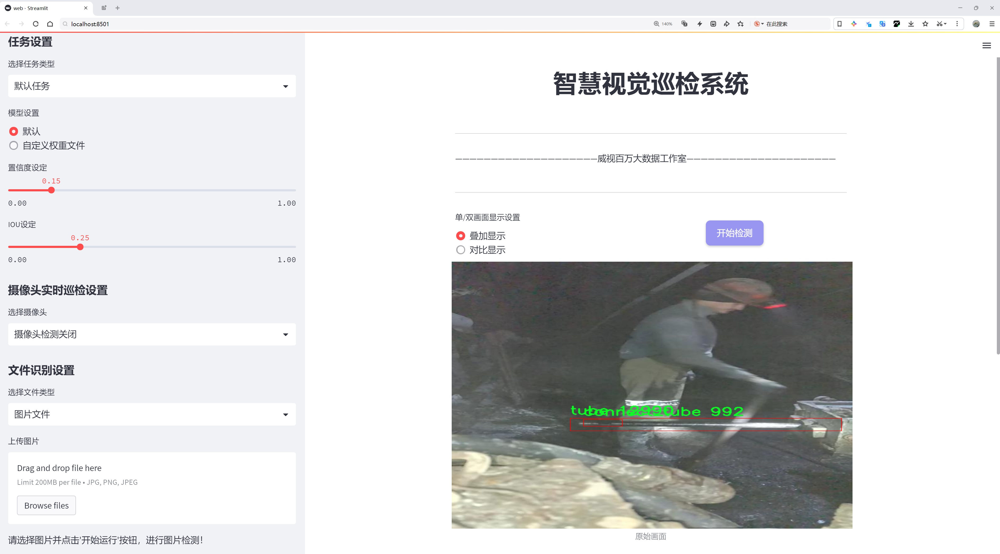

# 钢管加工长度检测检测系统源码分享
 # [一条龙教学YOLOV8标注好的数据集一键训练_70+全套改进创新点发刊_Web前端展示]

### 1.研究背景与意义

项目参考[AAAI Association for the Advancement of Artificial Intelligence](https://gitee.com/qunmasj/projects)

项目来源[AACV Association for the Advancement of Computer Vision](https://kdocs.cn/l/cszuIiCKVNis)

研究背景与意义

随着工业自动化和智能制造的迅速发展，钢管加工行业面临着日益严峻的市场竞争和生产效率的挑战。在这一背景下，如何提高钢管加工的精度和效率，成为了行业内亟待解决的问题。传统的钢管加工长度检测方法多依赖人工测量，既耗时又容易出现误差，难以满足现代化生产的需求。因此，开发一种高效、准确的钢管加工长度检测系统显得尤为重要。

近年来，深度学习技术的迅猛发展为物体检测任务提供了新的解决方案。YOLO（You Only Look Once）系列模型因其实时性和高精度而受到广泛关注，尤其是YOLOv8模型，其在目标检测领域的表现更是令人瞩目。通过对YOLOv8模型的改进，可以有效提升钢管加工长度检测的准确性和实时性，为钢管加工行业的智能化转型提供技术支持。

本研究旨在基于改进的YOLOv8模型，构建一个高效的钢管加工长度检测系统。为实现这一目标，我们将利用一个包含2500张图像的数据集，该数据集涵盖了两类钢管对象：连接管（connect_tube）和普通管（tube）。通过对这些图像的深度学习训练，系统能够自动识别和测量钢管的长度，显著提高检测效率和准确性。

在数据集的构建过程中，我们确保了图像的多样性和代表性，以涵盖不同规格、不同环境下的钢管。这一数据集不仅为模型的训练提供了丰富的样本，也为后续的模型评估和优化奠定了基础。通过对模型的不断迭代和改进，我们期望能够实现对钢管加工长度的高精度检测，从而为生产线的自动化提供可靠的技术保障。

本研究的意义不仅在于提升钢管加工的检测效率和准确性，更在于推动钢管加工行业的智能化进程。通过引入先进的深度学习技术，我们希望能够为行业内的企业提供一种可行的解决方案，帮助其在激烈的市场竞争中保持优势。此外，该系统的成功应用还将为其他制造行业的自动化检测提供借鉴，推动整个制造业的技术进步。

综上所述，基于改进YOLOv8的钢管加工长度检测系统的研究，不仅具有重要的理论价值，也具备广泛的应用前景。通过这一研究，我们期待能够为钢管加工行业的智能化转型贡献力量，同时为深度学习在工业应用中的进一步发展提供实践依据。

### 2.图片演示




##### 注意：由于此博客编辑较早，上面“2.图片演示”和“3.视频演示”展示的系统图片或者视频可能为老版本，新版本在老版本的基础上升级如下：（实际效果以升级的新版本为准）

  （1）适配了YOLOV8的“目标检测”模型和“实例分割”模型，通过加载相应的权重（.pt）文件即可自适应加载模型。

  （2）支持“图片识别”、“视频识别”、“摄像头实时识别”三种识别模式。

  （3）支持“图片识别”、“视频识别”、“摄像头实时识别”三种识别结果保存导出，解决手动导出（容易卡顿出现爆内存）存在的问题，识别完自动保存结果并导出到tempDir中。

  （4）支持Web前端系统中的标题、背景图等自定义修改，后面提供修改教程。

  另外本项目提供训练的数据集和训练教程,暂不提供权重文件（best.pt）,需要您按照教程进行训练后实现图片演示和Web前端界面演示的效果。

### 3.视频演示

[3.1 视频演示](https://www.bilibili.com/video/BV16qs6eTE4q/)

### 4.数据集信息展示

##### 4.1 本项目数据集详细数据（类别数＆类别名）

nc: 2
names: ['connect_tube', 'tube']


##### 4.2 本项目数据集信息介绍

数据集信息展示

在本研究中，我们采用了名为“team_tube detection”的数据集，以训练和改进YOLOv8模型在钢管加工长度检测系统中的应用。该数据集专注于钢管的检测，特别是连接管和普通管的识别，旨在提升自动化检测的准确性和效率。数据集的类别数量为2，具体类别包括“connect_tube”和“tube”。这种分类设计使得模型能够有效地区分不同类型的钢管，进而实现更为精确的长度检测。

“team_tube detection”数据集的构建考虑到了实际应用中的多样性和复杂性。数据集中包含了多种不同规格、材质和表面处理的钢管图像，确保了模型在训练过程中能够接触到丰富的样本。这些样本不仅涵盖了不同的管径和长度，还包括了在不同光照条件和背景下拍摄的图像，从而增强了模型的鲁棒性。通过这种多样化的样本选择，模型能够学习到钢管在各种环境下的特征，进而提高其在实际应用中的适应能力。

在数据集的标注过程中，所有图像均经过精确的人工标注，确保每个样本中的钢管位置和类别信息的准确性。这种高质量的标注是训练深度学习模型的关键，直接影响到模型的性能和检测精度。数据集中每个类别的样本数量经过合理配置，以保证模型在训练时能够获得均衡的学习机会，避免因样本不均衡而导致的偏差。

此外，为了进一步提升模型的泛化能力，数据集还进行了数据增强处理。通过对图像进行旋转、缩放、裁剪、翻转等操作，生成了多样化的训练样本。这些增强技术不仅增加了数据集的规模，还帮助模型学习到更为丰富的特征，从而提高其在实际应用中的表现。经过这些处理，模型在面对不同的钢管形态和环境变化时，能够保持较高的检测准确率。

在训练过程中，我们将“team_tube detection”数据集与YOLOv8模型相结合，利用其先进的特征提取和目标检测能力，进行多轮迭代训练。通过不断调整模型参数和优化算法，我们期望能够实现对钢管加工长度的高效检测。最终，经过充分训练的模型将能够在实际生产环境中实时识别和测量钢管长度，显著提高生产效率，降低人工检测的误差。

综上所述，“team_tube detection”数据集为改进YOLOv8的钢管加工长度检测系统提供了坚实的基础。通过精心设计的类别划分、丰富的样本多样性和高质量的标注，我们相信该数据集将极大地推动钢管检测技术的发展，助力实现更为智能化的制造流程。


### 5.全套项目环境部署视频教程（零基础手把手教学）

[5.1 环境部署教程链接（零基础手把手教学）](https://www.ixigua.com/7404473917358506534?logTag=c807d0cbc21c0ef59de5)


[5.2 安装Python虚拟环境创建和依赖库安装视频教程链接（零基础手把手教学）](https://www.ixigua.com/7404474678003106304?logTag=1f1041108cd1f708b01a)

### 6.手把手YOLOV8训练视频教程（零基础小白有手就能学会）

[6.1 手把手YOLOV8训练视频教程（零基础小白有手就能学会）](https://www.ixigua.com/7404477157818401292?logTag=d31a2dfd1983c9668658)

### 7.70+种全套YOLOV8创新点代码加载调参视频教程（一键加载写好的改进模型的配置文件）

[7.1 70+种全套YOLOV8创新点代码加载调参视频教程（一键加载写好的改进模型的配置文件）](https://www.ixigua.com/7404478314661806627?logTag=29066f8288e3f4eea3a4)

### 8.70+种全套YOLOV8创新点原理讲解（非科班也可以轻松写刊发刊，V10版本正在科研待更新）

由于篇幅限制，每个创新点的具体原理讲解就不一一展开，具体见下列网址中的创新点对应子项目的技术原理博客网址【Blog】：


[8.1 70+种全套YOLOV8创新点原理讲解链接](https://gitee.com/qunmasj/good)

### 9.系统功能展示（检测对象为举例，实际内容以本项目数据集为准）

图9.1.系统支持检测结果表格显示

  图9.2.系统支持置信度和IOU阈值手动调节

  图9.3.系统支持自定义加载权重文件best.pt(需要你通过步骤5中训练获得)

  图9.4.系统支持摄像头实时识别

  图9.5.系统支持图片识别

  图9.6.系统支持视频识别

  图9.7.系统支持识别结果文件自动保存

  图9.8.系统支持Excel导出检测结果数据


### 10.原始YOLOV8算法原理

原始YOLOv8算法原理

YOLOv8（You Only Look Once version 8）作为YOLO系列中的最新成员，代表了目标检测领域的一次重要进步。其设计理念基于对前几代YOLO模型的综合分析与改进，旨在实现更高的检测精度和速度，尤其是在复杂环境下的应用。YOLOv8的核心在于其创新的网络结构和无锚框（anchor-free）检测方法，这一转变使得模型在处理多样化的目标时，能够更灵活地适应不同的场景。

YOLOv8的网络架构主要由四个模块组成：输入端、主干网络、Neck端和输出端。输入端负责对输入图像进行预处理，包括Mosaic数据增强、自适应图片缩放和灰度填充等。这些技术不仅增强了数据的多样性，还提高了模型对不同场景的适应能力。主干网络则采用了CSPDarknet结构，通过卷积和池化等操作提取图像特征。相较于YOLOv5，YOLOv8引入了C2f模块，这一模块通过将输入特征图分为两个分支，分别进行降维处理，最终将多个分支的输出融合，形成更高维度的特征图。这种设计有效提升了特征提取的效率，增加了模型的表达能力。

在Neck端，YOLOv8利用了路径聚合网络（PAN）结构，通过上采样和下采样的方式对不同尺度的特征图进行融合。这一过程不仅保留了多尺度信息，还增强了特征的上下文关联性，从而提高了模型对目标的感知能力。输出端则采用了decoupled head结构，将分类和回归过程解耦，优化了正负样本的匹配和损失计算。这一设计使得YOLOv8在目标检测时能够更精确地定位目标，并减少了误检和漏检的情况。

YOLOv8的创新之处还在于其无锚框的检测方式。传统的锚框方法依赖于预定义的框架来进行目标定位，而YOLOv8则直接预测目标的中心点及其宽高比例。这一方法不仅减少了锚框的数量，降低了计算复杂度，还提高了检测速度和准确度。此外，YOLOv8在损失函数的设计上也进行了优化，采用了BCE（binary cross-entropy）计算分类损失，并结合DFL（distribution focal loss）和CIoU（complete intersection over union）损失函数来计算回归损失。这一系列的改进使得YOLOv8在训练过程中能够更好地优化模型参数，从而提升了整体性能。

尽管YOLOv8在许多方面表现出色，但在复杂水面环境下，仍然面临着一些挑战。小目标漂浮物的特征复杂且背景多样，导致YOLOv8在这些情况下可能出现定位误差和对目标感知能力不足的问题。为了解决这些问题，研究者们提出了YOLOv8-WSSOD算法，通过引入BiFormer双层路由注意力机制构建C2fBF模块，旨在减轻主干网络下采样过程中的噪声影响，保留特征提取过程中更细粒度的上下文信息。此外，针对小目标漏检的问题，YOLOv8-WSSOD还添加了一个更小的检测头，以提升网络对小目标的感知能力，并在Neck端引入GSConv和Slim-neck技术，以保持精度并降低计算量。

总的来说，YOLOv8通过其创新的网络结构和无锚框检测方法，在目标检测领域实现了显著的进步。尽管在某些复杂环境下仍存在不足，但其高效的特征提取和目标检测能力为未来的研究和应用提供了广阔的前景。随着对YOLOv8及其改进版本的不断探索，目标检测技术将在更多实际应用中发挥重要作用，推动相关领域的发展。


### 11.项目核心源码讲解（再也不用担心看不懂代码逻辑）

#### 11.1 code\ultralytics\models\yolo\segment\predict.py

以下是对给定代码的核心部分进行分析和详细注释的结果：

```python
# 导入必要的模块和类
from ultralytics.engine.results import Results
from ultralytics.models.yolo.detect.predict import DetectionPredictor
from ultralytics.utils import DEFAULT_CFG, ops

class SegmentationPredictor(DetectionPredictor):
    """
    SegmentationPredictor类，继承自DetectionPredictor类，用于基于分割模型的预测。
    """

    def __init__(self, cfg=DEFAULT_CFG, overrides=None, _callbacks=None):
        """
        初始化SegmentationPredictor，设置配置、覆盖参数和回调函数。
        
        参数:
        - cfg: 配置文件，默认为DEFAULT_CFG。
        - overrides: 覆盖默认配置的参数。
        - _callbacks: 可选的回调函数。
        """
        super().__init__(cfg, overrides, _callbacks)  # 调用父类的初始化方法
        self.args.task = "segment"  # 设置任务类型为分割

    def postprocess(self, preds, img, orig_imgs):
        """
        对每个输入图像的预测结果进行后处理，包括非极大值抑制和掩膜处理。
        
        参数:
        - preds: 模型的预测结果。
        - img: 输入图像。
        - orig_imgs: 原始输入图像，可能是一个批次的图像。
        
        返回:
        - results: 处理后的结果列表，包括原始图像、路径、类别名称、边界框和掩膜。
        """
        # 应用非极大值抑制，过滤掉低置信度的检测框
        p = ops.non_max_suppression(
            preds[0],  # 预测的边界框
            self.args.conf,  # 置信度阈值
            self.args.iou,  # IOU阈值
            agnostic=self.args.agnostic_nms,  # 是否进行类别无关的NMS
            max_det=self.args.max_det,  # 最大检测数量
            nc=len(self.model.names),  # 类别数量
            classes=self.args.classes,  # 指定的类别
        )

        # 如果输入图像不是列表，则将其转换为numpy数组
        if not isinstance(orig_imgs, list):
            orig_imgs = ops.convert_torch2numpy_batch(orig_imgs)

        results = []  # 初始化结果列表
        proto = preds[1][-1] if len(preds[1]) == 3 else preds[1]  # 获取掩膜原型

        # 遍历每个预测结果
        for i, pred in enumerate(p):
            orig_img = orig_imgs[i]  # 获取原始图像
            img_path = self.batch[0][i]  # 获取图像路径
            
            if not len(pred):  # 如果没有检测到目标
                masks = None  # 设置掩膜为None
            elif self.args.retina_masks:  # 如果使用Retina掩膜
                # 对边界框进行缩放
                pred[:, :4] = ops.scale_boxes(img.shape[2:], pred[:, :4], orig_img.shape)
                # 处理掩膜
                masks = ops.process_mask_native(proto[i], pred[:, 6:], pred[:, :4], orig_img.shape[:2])  # HWC
            else:  # 否则使用常规掩膜处理
                masks = ops.process_mask(proto[i], pred[:, 6:], pred[:, :4], img.shape[2:], upsample=True)  # HWC
                # 对边界框进行缩放
                pred[:, :4] = ops.scale_boxes(img.shape[2:], pred[:, :4], orig_img.shape)

            # 将结果添加到结果列表中
            results.append(Results(orig_img, path=img_path, names=self.model.names, boxes=pred[:, :6], masks=masks))
        
        return results  # 返回处理后的结果列表
```

### 代码分析
1. **类的定义**：`SegmentationPredictor`类继承自`DetectionPredictor`，用于处理图像分割任务。
2. **初始化方法**：在初始化时，调用父类的构造函数，并设置任务类型为“segment”。
3. **后处理方法**：`postprocess`方法负责对模型的预测结果进行后处理，包括非极大值抑制和掩膜的生成。根据输入的预测结果和原始图像，处理并返回一个包含检测结果的列表。
4. **非极大值抑制**：使用`ops.non_max_suppression`函数过滤掉低置信度的检测框，确保只保留最有可能的检测结果。
5. **掩膜处理**：根据不同的参数，使用不同的方法处理掩膜，确保掩膜与检测框的对应关系正确。

这段代码的核心功能是实现图像分割的预测，并对结果进行有效的后处理，以便后续使用。

这个文件是一个用于YOLO（You Only Look Once）模型的分割预测的实现，属于Ultralytics库的一部分。它定义了一个名为`SegmentationPredictor`的类，该类继承自`DetectionPredictor`，专门用于基于分割模型进行预测。

在类的构造函数`__init__`中，首先调用了父类的构造函数，并传入配置、覆盖参数和回调函数。接着，它将任务类型设置为“segment”，表明这个预测器的主要功能是进行图像分割。

`postprocess`方法是该类的核心功能之一，负责对模型的预测结果进行后处理。具体来说，它首先调用`non_max_suppression`函数，对预测结果进行非极大值抑制，以减少重叠框的数量。此函数使用了一些参数，如置信度阈值、IOU阈值、是否进行类别无关的NMS等。

接下来，方法检查输入的原始图像是否为列表格式，如果不是，则将其转换为NumPy数组。然后，它根据预测结果的长度确定是否使用原始的掩膜数据。对于每个预测结果，方法会提取原始图像和对应的图像路径。如果没有检测到目标（即预测结果为空），则掩膜设置为`None`。否则，根据是否需要使用Retina掩膜，调用不同的处理函数来生成掩膜，并将预测框的坐标进行缩放，以适应原始图像的尺寸。

最后，方法将处理后的结果封装到`Results`对象中，并将其添加到结果列表中。这个结果列表最终会被返回，包含了每张图像的原始数据、路径、类别名称、预测框和掩膜等信息。

整体来看，这个文件的功能是为YOLO模型提供图像分割的预测能力，并对预测结果进行有效的后处理，以便于后续的使用和分析。

#### 11.2 70+种YOLOv8算法改进源码大全和调试加载训练教程（非必要）\ultralytics\models\fastsam\prompt.py

以下是经过简化和注释的核心代码部分，保留了主要功能并进行了详细的中文注释：

```python
import os
import numpy as np
import torch
from PIL import Image
import cv2
from ultralytics.utils import TQDM

class FastSAMPrompt:
    """
    Fast Segment Anything Model类，用于图像标注和可视化。

    属性:
        device (str): 计算设备（'cuda'或'cpu'）。
        results: 目标检测或分割结果。
        source: 源图像或图像路径。
        clip: 用于线性分配的CLIP模型。
    """

    def __init__(self, source, results, device='cuda') -> None:
        """初始化FastSAMPrompt，设置源图像、结果和设备，并导入CLIP模型。"""
        self.device = device
        self.results = results
        self.source = source

        # 导入并分配CLIP模型
        try:
            import clip  # 用于线性分配
        except ImportError:
            from ultralytics.utils.checks import check_requirements
            check_requirements('git+https://github.com/openai/CLIP.git')
            import clip
        self.clip = clip

    @staticmethod
    def _format_results(result, filter=0):
        """将检测结果格式化为包含ID、分割、边界框、分数和面积的注释列表。"""
        annotations = []
        n = len(result.masks.data) if result.masks is not None else 0
        for i in range(n):
            mask = result.masks.data[i] == 1.0
            if torch.sum(mask) >= filter:
                annotation = {
                    'id': i,
                    'segmentation': mask.cpu().numpy(),
                    'bbox': result.boxes.data[i],
                    'score': result.boxes.conf[i]}
                annotation['area'] = annotation['segmentation'].sum()
                annotations.append(annotation)
        return annotations

    @torch.no_grad()
    def retrieve(self, model, preprocess, elements, search_text: str, device) -> int:
        """处理图像和文本，计算相似度，并返回softmax分数。"""
        preprocessed_images = [preprocess(image).to(device) for image in elements]
        tokenized_text = self.clip.tokenize([search_text]).to(device)
        stacked_images = torch.stack(preprocessed_images)
        image_features = model.encode_image(stacked_images)
        text_features = model.encode_text(tokenized_text)
        image_features /= image_features.norm(dim=-1, keepdim=True)
        text_features /= text_features.norm(dim=-1, keepdim=True)
        probs = 100.0 * image_features @ text_features.T
        return probs[:, 0].softmax(dim=0)

    def text_prompt(self, text):
        """处理文本提示，应用于现有结果并返回更新的结果。"""
        if self.results[0].masks is not None:
            format_results = self._format_results(self.results[0], 0)
            cropped_boxes, cropped_images, not_crop, filter_id, annotations = self._crop_image(format_results)
            clip_model, preprocess = self.clip.load('ViT-B/32', device=self.device)
            scores = self.retrieve(clip_model, preprocess, cropped_boxes, text, device=self.device)
            max_idx = scores.argsort()[-1]  # 获取最高分的索引
            max_idx += sum(np.array(filter_id) <= int(max_idx))  # 处理过滤的索引
            self.results[0].masks.data = torch.tensor(np.array([ann['segmentation'] for ann in annotations]))
        return self.results

    def _crop_image(self, format_results):
        """根据提供的注释格式裁剪图像，并返回裁剪的图像和相关数据。"""
        image = Image.fromarray(cv2.cvtColor(self.results[0].orig_img, cv2.COLOR_BGR2RGB))
        ori_w, ori_h = image.size
        annotations = format_results
        cropped_boxes = []
        cropped_images = []
        filter_id = []
        for _, mask in enumerate(annotations):
            if np.sum(mask['segmentation']) <= 100:
                filter_id.append(_)
                continue
            bbox = self._get_bbox_from_mask(mask['segmentation'])  # 获取mask的边界框
            cropped_boxes.append(self._segment_image(image, bbox))  # 保存裁剪的图像
            cropped_images.append(bbox)  # 保存裁剪的图像的边界框

        return cropped_boxes, cropped_images, filter_id, annotations

    @staticmethod
    def _segment_image(image, bbox):
        """根据提供的边界框坐标对给定图像进行分割。"""
        image_array = np.array(image)
        segmented_image_array = np.zeros_like(image_array)
        x1, y1, x2, y2 = bbox
        segmented_image_array[y1:y2, x1:x2] = image_array[y1:y2, x1:x2]
        segmented_image = Image.fromarray(segmented_image_array)
        black_image = Image.new('RGB', image.size, (255, 255, 255))
        transparency_mask = np.zeros((image_array.shape[0], image_array.shape[1]), dtype=np.uint8)
        transparency_mask[y1:y2, x1:x2] = 255
        transparency_mask_image = Image.fromarray(transparency_mask, mode='L')
        black_image.paste(segmented_image, mask=transparency_mask_image)
        return black_image

    def everything_prompt(self):
        """返回类中之前方法处理的结果。"""
        return self.results
```

### 代码说明：
1. **类的定义**：`FastSAMPrompt`类用于处理图像分割和标注。
2. **初始化方法**：设置设备、源图像和结果，并导入CLIP模型。
3. **结果格式化**：`_format_results`方法将检测结果格式化为包含必要信息的列表。
4. **图像检索**：`retrieve`方法处理图像和文本，计算相似度并返回softmax分数。
5. **文本提示**：`text_prompt`方法根据文本提示更新分割结果。
6. **图像裁剪**：`_crop_image`方法根据分割结果裁剪图像。
7. **图像分割**：`_segment_image`方法根据边界框对图像进行分割。
8. **获取所有结果**：`everything_prompt`方法返回处理后的结果。

该代码保留了主要功能，并通过注释解释了每个方法的作用和逻辑。

这个程序文件定义了一个名为 `FastSAMPrompt` 的类，主要用于图像注释和可视化，特别是在图像分割任务中。该类包含多个方法，用于处理图像、格式化检测结果、绘制注释以及与 CLIP 模型进行交互。

在初始化方法 `__init__` 中，类接受源图像、检测结果和计算设备（如 CUDA 或 CPU）作为参数，并尝试导入 CLIP 模型。如果 CLIP 模型未安装，程序会通过检查要求来自动安装。

`_segment_image` 方法根据给定的边界框（bounding box）对图像进行分割，返回一个新的图像，其中只保留指定区域的内容，并将其他区域填充为白色。

`_format_results` 方法将检测结果格式化为包含 ID、分割掩码、边界框、置信度分数和区域的注释列表。该方法过滤掉分割区域小于指定阈值的结果。

`_get_bbox_from_mask` 方法通过对掩码应用形态学变换来获取边界框，返回包含边界框坐标的列表。

`plot` 方法用于在图像上绘制注释、边界框和点，并将结果保存到指定的输出目录。该方法支持多种参数配置，例如是否使用随机颜色、是否绘制轮廓等。

`fast_show_mask` 方法快速显示掩码注释在给定的 matplotlib 轴上，支持随机颜色和绘制边界框。

`retrieve` 方法处理图像和文本，通过 CLIP 模型计算相似度并返回 softmax 分数，用于文本提示的处理。

`_crop_image` 方法根据提供的注释格式裁剪图像，返回裁剪后的图像和相关数据。

`box_prompt` 方法修改边界框属性，并计算掩码与边界框之间的交并比（IoU），以便进行进一步的处理。

`point_prompt` 方法根据用户输入的点调整检测到的掩码，并返回修改后的结果。

`text_prompt` 方法处理文本提示，将其应用于现有结果，并返回更新后的结果。

最后，`everything_prompt` 方法返回类中处理过的结果，方便后续使用。

整体而言，这个类提供了一系列功能强大的方法，能够在图像分割和注释任务中进行灵活的处理和可视化，适用于需要高效图像处理的应用场景。

#### 11.3 ui.py

以下是代码中最核心的部分，并附上详细的中文注释：

```python
import sys
import subprocess

def run_script(script_path):
    """
    使用当前 Python 环境运行指定的脚本。

    Args:
        script_path (str): 要运行的脚本路径

    Returns:
        None
    """
    # 获取当前 Python 解释器的路径
    python_path = sys.executable

    # 构建运行命令，使用 streamlit 运行指定的脚本
    command = f'"{python_path}" -m streamlit run "{script_path}"'

    # 执行命令
    result = subprocess.run(command, shell=True)
    # 检查命令执行的返回码，若不为0则表示出错
    if result.returncode != 0:
        print("脚本运行出错。")


# 实例化并运行应用
if __name__ == "__main__":
    # 指定要运行的脚本路径
    script_path = "web.py"  # 这里可以替换为实际的脚本路径

    # 调用函数运行脚本
    run_script(script_path)
```

### 代码注释说明：
1. **导入模块**：
   - `sys`：用于访问与 Python 解释器紧密相关的变量和函数。
   - `subprocess`：用于创建新进程、连接到它们的输入/输出/错误管道，并获得返回码。

2. **定义 `run_script` 函数**：
   - 该函数接收一个脚本路径作为参数，并在当前 Python 环境中运行该脚本。

3. **获取 Python 解释器路径**：
   - 使用 `sys.executable` 获取当前 Python 解释器的完整路径，以确保使用正确的 Python 环境。

4. **构建命令**：
   - 使用 f-string 格式化字符串构建命令，调用 `streamlit` 模块运行指定的脚本。

5. **执行命令**：
   - 使用 `subprocess.run` 执行构建的命令，并设置 `shell=True` 以便在 shell 中运行命令。

6. **检查返回码**：
   - 检查命令执行后的返回码，如果返回码不为0，表示脚本运行出错，打印错误信息。

7. **主程序入口**：
   - 使用 `if __name__ == "__main__":` 确保只有在直接运行该脚本时才会执行以下代码。
   - 指定要运行的脚本路径，并调用 `run_script` 函数执行该脚本。

这个程序文件的主要功能是通过当前的 Python 环境来运行一个指定的脚本，具体来说是一个名为 `web.py` 的脚本。程序首先导入了必要的模块，包括 `sys`、`os` 和 `subprocess`，以及一个自定义的 `abs_path` 函数，这个函数可能用于获取文件的绝对路径。

在 `run_script` 函数中，首先获取当前 Python 解释器的路径，这样可以确保使用正确的 Python 环境来执行脚本。接着，构建一个命令字符串，该命令使用 `streamlit` 来运行指定的脚本。`streamlit` 是一个用于构建数据应用的库，通常用于快速创建和共享数据应用。

然后，使用 `subprocess.run` 方法来执行构建好的命令。这个方法会在一个新的进程中运行命令，并等待其完成。如果命令执行的返回码不为零，表示脚本运行出错，程序会打印出相应的错误信息。

在文件的最后部分，使用 `if __name__ == "__main__":` 语句来确保只有在直接运行该文件时才会执行后面的代码。这里指定了要运行的脚本路径 `web.py`，并调用 `run_script` 函数来执行它。

总体来说，这个程序是一个简单的脚本启动器，主要用于方便地运行一个 Streamlit 应用。

#### 11.4 code\ultralytics\data\explorer\__init__.py

以下是代码中最核心的部分，并附上详细的中文注释：

```python
# 导入Ultralytics YOLO库的工具函数
from .utils import plot_query_result

# 定义模块的公开接口，指定可以被外部访问的成员
__all__ = ["plot_query_result"]
```

### 注释说明：
1. `from .utils import plot_query_result`：这一行代码从当前模块的 `utils` 文件中导入了 `plot_query_result` 函数。这个函数可能用于处理或可视化查询结果。
   
2. `__all__ = ["plot_query_result"]`：这一行代码定义了模块的公开接口，只有在使用 `from module import *` 语句时，`plot_query_result` 函数会被导入。这样可以控制模块的可见性，避免不必要的内部实现细节被外部访问。

这个程序文件是一个Python模块，属于Ultralytics YOLO项目的一部分。文件的主要功能是导入并暴露一个名为`plot_query_result`的函数，供其他模块使用。

首先，文件开头的注释部分表明这是Ultralytics YOLO项目的一部分，并且该项目遵循AGPL-3.0许可证。这种许可证通常用于开源软件，允许用户自由使用、修改和分发软件，但要求任何派生作品也必须以相同的许可证发布。

接下来，代码中的`from .utils import plot_query_result`语句表示从同一包中的`utils`模块导入`plot_query_result`函数。这意味着`plot_query_result`是一个在`utils`模块中定义的函数，可能用于处理和可视化与YOLO模型相关的查询结果。

最后，`__all__`变量的定义指定了当使用`from module import *`语句时，应该导入哪些名称。在这里，`__all__`只包含`plot_query_result`，这意味着只有这个函数会被导入，而其他未列出的名称将不会被导入。这是一种控制模块导出接口的方式，帮助用户了解该模块的公共API。

总的来说，这个文件的作用是作为一个接口，简化了`plot_query_result`函数的访问，同时保持了模块的组织性和可读性。

#### 11.5 70+种YOLOv8算法改进源码大全和调试加载训练教程（非必要）\ultralytics\nn\extra_modules\ops_dcnv3\setup.py

以下是经过简化和注释的核心代码部分：

```python
# 导入必要的库
import os
import glob
import torch
from torch.utils.cpp_extension import CUDA_HOME, CppExtension, CUDAExtension
from setuptools import find_packages, setup

# 定义依赖包
requirements = ["torch", "torchvision"]

def get_extensions():
    # 获取当前文件目录
    this_dir = os.path.dirname(os.path.abspath(__file__))
    # 定义扩展模块的源代码目录
    extensions_dir = os.path.join(this_dir, "src")

    # 获取主文件和CPU、CUDA源文件
    main_file = glob.glob(os.path.join(extensions_dir, "*.cpp"))
    source_cpu = glob.glob(os.path.join(extensions_dir, "cpu", "*.cpp"))
    source_cuda = glob.glob(os.path.join(extensions_dir, "cuda", "*.cu"))

    # 合并源文件
    sources = main_file + source_cpu
    extension = CppExtension  # 默认使用 CppExtension
    extra_compile_args = {"cxx": []}  # 编译参数
    define_macros = []  # 宏定义

    # 检查CUDA是否可用
    if torch.cuda.is_available() and CUDA_HOME is not None:
        extension = CUDAExtension  # 使用 CUDAExtension
        sources += source_cuda  # 添加CUDA源文件
        define_macros += [("WITH_CUDA", None)]  # 定义宏
        extra_compile_args["nvcc"] = []  # CUDA编译参数
    else:
        raise NotImplementedError('Cuda is not available')  # 抛出异常

    # 生成完整的源文件路径
    sources = [os.path.join(extensions_dir, s) for s in sources]
    include_dirs = [extensions_dir]  # 包含目录

    # 创建扩展模块
    ext_modules = [
        extension(
            "DCNv3",  # 模块名称
            sources,  # 源文件
            include_dirs=include_dirs,  # 包含目录
            define_macros=define_macros,  # 宏定义
            extra_compile_args=extra_compile_args,  # 编译参数
        )
    ]
    return ext_modules  # 返回扩展模块列表

# 设置包信息
setup(
    name="DCNv3",  # 包名称
    version="1.1",  # 版本号
    author="InternImage",  # 作者
    url="https://github.com/OpenGVLab/InternImage",  # 项目链接
    description="PyTorch Wrapper for CUDA Functions of DCNv3",  # 描述
    packages=find_packages(exclude=("configs", "tests")),  # 查找包
    ext_modules=get_extensions(),  # 获取扩展模块
    cmdclass={"build_ext": torch.utils.cpp_extension.BuildExtension},  # 指定构建扩展的命令类
)
```

### 代码注释说明：
1. **导入库**：导入必要的库以支持CUDA扩展和包的构建。
2. **依赖包**：定义项目所需的依赖包。
3. **获取扩展函数**：该函数负责查找源文件并根据CUDA的可用性选择合适的扩展类型。
4. **源文件处理**：通过`glob`模块获取源文件路径，并根据CUDA的可用性选择相应的编译选项。
5. **模块设置**：使用`setuptools`的`setup`函数来配置包的基本信息和扩展模块。

这个程序文件是一个Python的`setup.py`脚本，用于构建和安装一个名为“DCNv3”的扩展模块，该模块是针对PyTorch的CUDA函数的封装。该文件的主要功能是设置编译环境，查找源代码文件，并配置扩展模块的构建参数。

首先，文件开头包含了一些版权信息和许可证声明，表明该代码是由OpenGVLab开发并遵循MIT许可证。

接下来，导入了一些必要的库，包括`os`和`glob`用于文件路径处理，`torch`用于深度学习框架的功能，以及`torch.utils.cpp_extension`中的`CUDA_HOME`、`CppExtension`和`CUDAExtension`用于处理C++和CUDA扩展的构建。

`requirements`列表定义了该模块所需的依赖库，包括`torch`和`torchvision`。

`get_extensions`函数是文件的核心部分。它首先获取当前文件的目录和扩展模块的源代码目录。然后，使用`glob`模块查找源代码文件，包括主文件、CPU和CUDA相关的源文件。主文件和CPU源文件会被合并到`sources`列表中。

接着，函数判断CUDA是否可用。如果可用，则使用`CUDAExtension`来处理CUDA源文件，并将其添加到`sources`列表中，同时定义了一个宏`WITH_CUDA`。如果CUDA不可用，则抛出一个`NotImplementedError`异常，提示CUDA不可用。

之后，所有源文件的路径被组合，并设置了包含目录。接下来，创建了一个扩展模块的列表，包含了模块的名称、源文件、包含目录、宏定义和编译参数。

最后，`setup`函数被调用，设置了模块的名称、版本、作者、项目网址、描述、要包含的包（排除了`configs`和`tests`目录），以及通过`get_extensions`函数获取的扩展模块。`cmdclass`参数指定了使用`torch.utils.cpp_extension.BuildExtension`来构建扩展。

总体而言，这个`setup.py`文件的目的是为DCNv3模块的构建和安装提供必要的配置，确保在支持CUDA的环境中能够正确编译和链接相应的C++和CUDA代码。

#### 11.6 train.py

以下是代码中最核心的部分，并附上详细的中文注释：

```python
class DetectionTrainer(BaseTrainer):
    """
    扩展自 BaseTrainer 类的检测模型训练类。
    """

    def build_dataset(self, img_path, mode="train", batch=None):
        """
        构建 YOLO 数据集。

        参数:
            img_path (str): 包含图像的文件夹路径。
            mode (str): 模式，`train` 或 `val`，用户可以为每种模式自定义不同的数据增强。
            batch (int, optional): 批次大小，仅用于 `rect` 模式。默认为 None。
        """
        gs = max(int(de_parallel(self.model).stride.max() if self.model else 0), 32)
        return build_yolo_dataset(self.args, img_path, batch, self.data, mode=mode, rect=mode == "val", stride=gs)

    def get_dataloader(self, dataset_path, batch_size=16, rank=0, mode="train"):
        """构造并返回数据加载器。"""
        assert mode in ["train", "val"]  # 确保模式是训练或验证
        with torch_distributed_zero_first(rank):  # 在分布式环境中，确保数据集只初始化一次
            dataset = self.build_dataset(dataset_path, mode, batch_size)  # 构建数据集
        shuffle = mode == "train"  # 训练模式下打乱数据
        if getattr(dataset, "rect", False) and shuffle:
            LOGGER.warning("WARNING ⚠️ 'rect=True' 与 DataLoader 的 shuffle 不兼容，设置 shuffle=False")
            shuffle = False
        workers = self.args.workers if mode == "train" else self.args.workers * 2  # 根据模式设置工作线程数
        return build_dataloader(dataset, batch_size, workers, shuffle, rank)  # 返回数据加载器

    def preprocess_batch(self, batch):
        """对一批图像进行预处理，包括缩放和转换为浮点数。"""
        batch["img"] = batch["img"].to(self.device, non_blocking=True).float() / 255  # 将图像转换为浮点数并归一化
        if self.args.multi_scale:  # 如果启用多尺度
            imgs = batch["img"]
            sz = (
                random.randrange(self.args.imgsz * 0.5, self.args.imgsz * 1.5 + self.stride)
                // self.stride
                * self.stride
            )  # 随机选择一个尺寸
            sf = sz / max(imgs.shape[2:])  # 计算缩放因子
            if sf != 1:  # 如果缩放因子不为1
                ns = [
                    math.ceil(x * sf / self.stride) * self.stride for x in imgs.shape[2:]
                ]  # 计算新的形状
                imgs = nn.functional.interpolate(imgs, size=ns, mode="bilinear", align_corners=False)  # 进行插值
            batch["img"] = imgs  # 更新图像
        return batch

    def set_model_attributes(self):
        """设置模型的属性，包括类别数量和名称。"""
        self.model.nc = self.data["nc"]  # 将类别数量附加到模型
        self.model.names = self.data["names"]  # 将类别名称附加到模型
        self.model.args = self.args  # 将超参数附加到模型

    def get_model(self, cfg=None, weights=None, verbose=True):
        """返回一个 YOLO 检测模型。"""
        model = DetectionModel(cfg, nc=self.data["nc"], verbose=verbose and RANK == -1)  # 创建检测模型
        if weights:
            model.load(weights)  # 加载权重
        return model

    def get_validator(self):
        """返回 YOLO 模型验证器。"""
        self.loss_names = "box_loss", "cls_loss", "dfl_loss"  # 定义损失名称
        return yolo.detect.DetectionValidator(
            self.test_loader, save_dir=self.save_dir, args=copy(self.args), _callbacks=self.callbacks
        )

    def plot_training_samples(self, batch, ni):
        """绘制带有注释的训练样本。"""
        plot_images(
            images=batch["img"],
            batch_idx=batch["batch_idx"],
            cls=batch["cls"].squeeze(-1),
            bboxes=batch["bboxes"],
            paths=batch["im_file"],
            fname=self.save_dir / f"train_batch{ni}.jpg",
            on_plot=self.on_plot,
        )

    def plot_metrics(self):
        """从 CSV 文件中绘制指标。"""
        plot_results(file=self.csv, on_plot=self.on_plot)  # 保存结果图像
```

### 代码核心部分说明：
1. **DetectionTrainer 类**：继承自 `BaseTrainer`，用于处理 YOLO 模型的训练。
2. **build_dataset 方法**：构建数据集，支持训练和验证模式。
3. **get_dataloader 方法**：构造数据加载器，支持多线程和数据打乱。
4. **preprocess_batch 方法**：对图像批次进行预处理，包括归一化和缩放。
5. **set_model_attributes 方法**：设置模型的类别数量和名称。
6. **get_model 方法**：返回一个 YOLO 检测模型，并可加载预训练权重。
7. **get_validator 方法**：返回用于验证模型的验证器。
8. **plot_training_samples 和 plot_metrics 方法**：用于可视化训练样本和训练指标。

这个程序文件 `train.py` 是一个用于训练 YOLO（You Only Look Once）目标检测模型的脚本，继承自 `BaseTrainer` 类。文件中包含了多个方法，主要用于构建数据集、加载数据、预处理图像、设置模型属性、获取模型、验证模型、记录损失、显示训练进度、绘制训练样本和绘制训练指标等功能。

首先，`DetectionTrainer` 类的构造函数接收参数并设置模型的基本属性。`build_dataset` 方法用于构建 YOLO 数据集，接受图像路径、模式（训练或验证）和批次大小作为参数。它会根据模型的步幅计算合适的大小，并调用 `build_yolo_dataset` 函数来生成数据集。

`get_dataloader` 方法则负责创建数据加载器，确保在分布式训练时只初始化一次数据集。它会根据模式选择是否打乱数据，并根据需要调整工作线程的数量。`preprocess_batch` 方法用于对图像批次进行预处理，包括缩放和转换为浮点数格式，同时支持多尺度训练。

在 `set_model_attributes` 方法中，模型的类别数量和名称会被设置，以便于后续的训练和验证。`get_model` 方法返回一个 YOLO 检测模型实例，并可以加载预训练权重。

`get_validator` 方法返回一个用于模型验证的 `DetectionValidator` 实例，记录损失名称。`label_loss_items` 方法则用于返回带有标签的训练损失字典，便于监控训练过程中的损失变化。

`progress_string` 方法返回一个格式化的字符串，显示训练进度，包括当前的轮次、GPU 内存使用情况、损失值、实例数量和图像大小等信息。`plot_training_samples` 方法用于绘制训练样本及其标注，方便可视化训练效果。

最后，`plot_metrics` 和 `plot_training_labels` 方法分别用于绘制训练过程中的指标和创建带标签的训练图，帮助用户更好地理解模型的训练状态和效果。

整体而言，这个文件提供了一个完整的训练框架，涵盖了从数据加载到模型训练和评估的各个环节，适用于使用 YOLO 模型进行目标检测任务的开发者。

### 12.系统整体结构（节选）

### 整体功能和构架概括

该项目是一个基于YOLO（You Only Look Once）模型的目标检测和图像分割框架，主要用于训练、预测和评估目标检测和分割任务。项目结构清晰，包含多个模块和子模块，分别负责不同的功能，如数据处理、模型训练、预测、可视化和回调等。整体架构包括以下几个主要部分：

1. **模型定义与训练**：包括YOLO模型的定义、训练过程的管理和优化。
2. **数据处理**：包括数据集的构建、数据加载和预处理。
3. **预测与评估**：提供预测功能，并对模型的输出进行后处理和评估。
4. **可视化**：绘制训练样本、损失曲线和其他指标，以便于用户理解模型的训练状态。
5. **回调机制**：支持在训练过程中记录和监控模型性能。

### 文件功能整理表

| 文件路径                                                                 | 功能描述                                                                                         |
|--------------------------------------------------------------------------|--------------------------------------------------------------------------------------------------|
| `code\ultralytics\models\yolo\segment\predict.py`                      | 实现YOLO模型的图像分割预测功能，包括后处理和结果封装。                                           |
| `70+种YOLOv8算法改进源码大全和调试加载训练教程（非必要）\ultralytics\models\fastsam\prompt.py` | 提供图像注释和可视化功能，支持与CLIP模型的交互，处理分割掩码和边界框。                           |
| `ui.py`                                                                 | 启动一个Streamlit应用，用于可视化和交互式展示模型的训练和预测结果。                              |
| `code\ultralytics\data\explorer\__init__.py`                          | 导入并暴露`plot_query_result`函数，作为数据可视化模块的接口。                                   |
| `70+种YOLOv8算法改进源码大全和调试加载训练教程（非必要）\ultralytics\nn\extra_modules\ops_dcnv3\setup.py` | 配置和安装DCNv3扩展模块，处理C++和CUDA代码的编译。                                              |
| `train.py`                                                              | 负责模型的训练过程，包括数据集构建、模型加载、损失记录和训练进度显示等功能。                   |
| `70+种YOLOv8算法改进源码大全和调试加载训练教程（非必要）\ultralytics\utils\callbacks\wb.py` | 提供与Weights & Biases集成的回调功能，用于监控和记录训练过程中的指标。                          |
| `70+种YOLOv8算法改进源码大全和调试加载训练教程（非必要）\ultralytics\utils\callbacks\mlflow.py` | 提供与MLflow集成的回调功能，用于记录和管理模型训练过程中的实验。                               |
| `70+种YOLOv8算法改进源码大全和调试加载训练教程（非必要）\ultralytics\utils\callbacks\base.py` | 定义回调的基类，提供基本的回调接口和功能，供其他回调类继承。                                    |
| `code\ultralytics\__init__.py`                                         | 初始化ultralytics模块，可能包含一些全局配置和导入。                                              |
| `code\ultralytics\nn\__init__.py`                                      | 初始化nn模块，可能包含神经网络相关的功能和模型定义。                                            |
| `code\ultralytics\models\yolo\segment\val.py`                         | 实现YOLO模型的验证功能，负责评估模型在验证集上的性能。                                          |
| `70+种YOLOv8算法改进源码大全和调试加载训练教程（非必要）\ultralytics\models\yolo\pose\predict.py` | 实现YOLO模型的姿态估计预测功能，处理与姿态相关的图像数据。                                      |

这个表格总结了项目中各个文件的主要功能，便于理解项目的整体结构和各个模块之间的关系。

注意：由于此博客编辑较早，上面“11.项目核心源码讲解（再也不用担心看不懂代码逻辑）”中部分代码可能会优化升级，仅供参考学习，完整“训练源码”、“Web前端界面”和“70+种创新点源码”以“13.完整训练+Web前端界面+70+种创新点源码、数据集获取”的内容为准。

### 13.完整训练+Web前端界面+70+种创新点源码、数据集获取


# [下载链接：https://mbd.pub/o/bread/ZpuZl5py](https://mbd.pub/o/bread/ZpuZl5py)